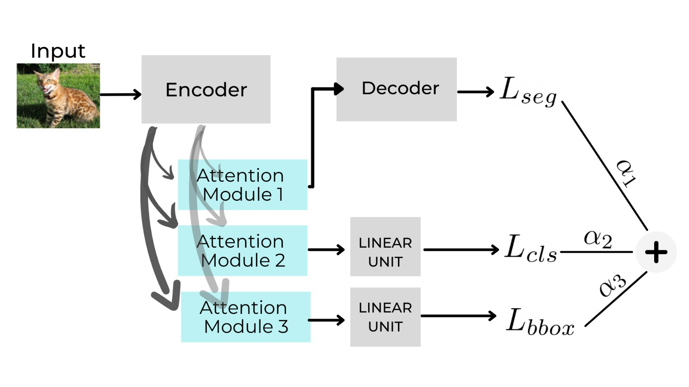

# Multi-Task Learning for Image Segmentation using attention blocks

This repo contains the code for "Enhancing Multi Task Learning for Image Segmentaion using soft attention blocks and self-supervised auxilary tasks.  <br>

The motivation was to check the effectiveness of various MTL architecture against the baseline SegNet model. MTL model with auxilary tasks of Boundary box detection and Classification was implemented. Attention masks were added to the MTL model (MTAN). Experiments were carried out by adding attention masks and additional self-supervised auxilary tasks of edge detection, colourisation and denosing. The full report can be viewed [here](https://github.com/SulakshanaChakraborty/Multi-Task-Learning/blob/main/MTL-Report.pdf).

### MTAN model architecture
<p>

</p>

## How to run the code

* Clone the repository
* Create an enviroment using the [requirements.txt](https://github.com/SulakshanaChakraborty/Multi-Task-Learning/blob/main/requirements.txt) file
* Run Inference:

```python 
python cw2_main.py -m 'MTL-Segnet' -d 'cpu' -e '50' -b '10' -tr 'y' -ts 'n'
```
Plese refere to [instructions.txt](https://github.com/SulakshanaChakraborty/Multi-Task-Learning/blob/main/Instructions.txt) for further detailed instructions on running training/inference.

## Pretrained models

The pretrained models can be downloaded from ##TODO add link. Following is the list of different models:

* **Segnet-1task-no-pretrained** : Vanilla Segnet model which outputs the segmentaion mask, without any pre-trained weights

* **MTL-Segnet-no-pretrained** : Multi task learning Segnet model with Bouding Box Regression, Segmentation and Classification tasks, without any pre-trained weights

* **Segnet-1task**: Vanilla Segnet model which outputs the segmentaion mask,with pre-trained weights in encoder

* **MTL-Segnet**: Multi task learning Segnet model with Bouding Box Regression, Segmentation and Classification tasks, with pre-trained weights in encoder

* **MTL-Attention** : Soft Attention masks applied to the MTL Segnet model, with pre-trained weights in encoder

* **MTL-Attention-without-classification**: MTL Attention model with only Bounding Box Regression and Segmentaion, with pre-trained weights in encoder

* **MTL-Attention-without-bbox**: MTL Attention model with only Bounding Box Regression and Segmentaion, with pre-trained weights in encoder

* **MTL-Attention-with-colorization**: MTL Attention model with added self-supervised task of colorization, with pre-trained weights in encoder

* **MTL-Attention-with-canny**: MTL Attention model with added self-supervised task of canny edge detection, with pre-trained weights in encoder

* **MTL-Attention-with-denoising**: MTL Attention model with added self-supervised task of denoising, with pre-trained weights in encoder

## Dataset
The dataset can be downloaded from [here](s). Please maintain the following folder structure as present in the zip file.

© 2022 GitHub, Inc.
Terms
Privacy
Security
Status
Docs
Contact GitHub
Pricing
API
Training
Blog
About

